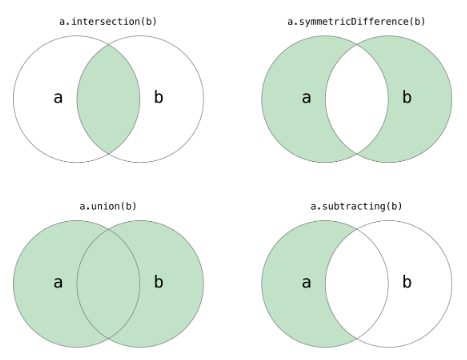

# 一、知识点回顾
1. 列表
  - 列表的增删改查
  - 列表的嵌套
2. 元组和元组的嵌套
3. range
4. 字典
   - 字典的增删改查
   - 字典的嵌套
5. 集合
Python中的集合跟数学上的集合是一致的，不允许有重复元素，而且可以进行交集、并集、差集等运算。
 
   - 集合增删改查
```Python
# 创建集合的字面量语法
set1 = {1, 2, 3, 3, 3, 2}
print(set1)
print('Length =', len(set1))
# 创建集合的构造器语法(面向对象部分会进行详细讲解)
set2 = set(range(1, 10))
set3 = set((1, 2, 3, 3, 2, 1))
print(set2, set3)
# 创建集合的推导式语法(推导式也可以用于推导集合)
set4 = {num for num in range(1, 100) if num % 3 == 0 or num % 5 == 0}
print(set4)
```

向集合添加元素和从集合删除元素。

```Python
set1.add(4)
set1.add(5)
set2.update([11, 12])
set2.discard(5)
if 4 in set2:
    set2.remove(4)
print(set1, set2)
print(set3.pop())
print(set3)
```
   - 集合运算
集合的成员、交集、并集、差集等运算。

```Python
# 集合的交集、并集、差集、对称差运算
print(set1 & set2)
# print(set1.intersection(set2))
print(set1 | set2)
# print(set1.union(set2))
print(set1 - set2)
# print(set1.difference(set2))
print(set1 ^ set2)
# print(set1.symmetric_difference(set2))
# 判断子集和超集
print(set2 <= set1)
# print(set2.issubset(set1))
print(set3 <= set1)
# print(set3.issubset(set1))
print(set1 >= set2)
# print(set1.issuperset(set2))
print(set1 >= set3)
# print(set1.issuperset(set3))
```
# 二、day003 作业

---
### 1，写代码，有如下列表，按照要求实现每⼀个功能
```python
    li = ["lex", "WuSi", "ruantian", "barry", "wenzhou"]
    1)计算列表的⻓度并输出
    2)列表中追加元素"seven",并输出添加后的列表
    3)请在列表的第1个位置插⼊元素"Tony",并输出添加后的列表
    4)请修改列表第2个位置的元素为"Kelly",并输出修改后的列表
    5)请将列表l2=[1,"a",3,4,"heart"]的每⼀个元素添加到列表li中，⼀⾏代码实现，不允许循环添加。
    6)请将字符串s = "qwert"的每⼀个元素添加到列表li中，⼀⾏代码实现，不允许循环添加。
    7)请删除列表中的元素"eric",并输出添加后的列表
    8)请删除列表中的第2个元素，并输出删除的元素和删除元素后的列表
    9)请删除列表中的第2⾄4个元素，并输出删除元素后的列表
    10)请将列表所有得元素反转，并输出反转后的列表
    11)请计算出"lex"元素在列表li中出现的次数，并输出该次数。
```
### 2，写代码，有如下列表，利⽤切⽚实现每⼀个功能
```python
li = [1, 3, 2, "a", 4, "b", 5,"c"]
1)通过对li列表的切⽚形成新的列表l1,l1 = [1,3,2]
2)通过对li列表的切⽚形成新的列表l2,l2 = ["a",4,"b"]
3)通过对li列表的切⽚形成新的列表l3,l3 = ["1,2,4,5]
4)通过对li列表的切⽚形成新的列表l4,l4 = [3,"a","b"]
5)通过对li列表的切⽚形成新的列表l5,l5 = ["c"]
6)通过对li列表的切⽚形成新的列表l6,l6 = ["b","a",3]
```

### 3,写代码，有如下列表，按照要求实现每⼀个功能。
```python
    lis = [2, 3, "k", ["qwe", 20, ["k1", ["tt", 3, "1"]], 89], "ab", "adv"]
    1)将列表lis中的"tt"变成⼤写（⽤两种⽅式）。
    2)将列表中的数字3变成字符串"100"（⽤两种⽅式）。
    3)将列表中的字符串"1"变成数字101（⽤两种⽅式）。
```
### 4,请⽤代码实现：
```python
li = ["lex", "eric", "rain"]
    利⽤下划线将列表的每⼀个元素拼接成字符串"lex_eric_rain"
```

### 5.利⽤for循环和range打印出下⾯列表的索引。
```python
    li = ["alex", "WuSir", "ritian", "barry", "wenzhou"]
```
### 6.利⽤for循环和range找出100以内所有的偶数并将这些偶数插⼊到⼀个新列表中。

### 7.利⽤for循环和range 找出50以内能被3整除的数，并将这些数插⼊到⼀个新列表中。

### 8.利⽤for循环和range从100~1，倒序打印。
### 9.利⽤for循环和range从100~10，倒序将所有的偶数添加到⼀个新列表中，然后对列表的元素进⾏筛选，将能被4整除的数留下来。
### 10，利⽤for循环和range，将1-30的数字⼀次添加到⼀个列表中，并循环这个列表，将能被3整除的数改成*。
### 11，查找列表li中的元素，移除每个元素的空格，并找出以"A"或者"a"开头，并以"c"结尾的所有元素，并添加到⼀个新列表中,最后循环打印这个新列表。
```python
li = ["TaiBai ", “le xC", “AbC ", "egon", " ri TiAn", "WuSir", " aqc"]
```
### 12，开发敏感词语过滤程序，提示⽤户输⼊评论内容，如果⽤户输⼊的内容中包含特殊的字符：
```python
    敏感词列表 li = ["苍⽼师", "东京热", "武藤兰", "波多野结⾐"]
    则将⽤户输⼊的内容中的敏感词汇替换成等⻓度的*（苍⽼师就替换***），并添
    加到⼀个列表中；如果⽤户输⼊的内容没有敏感词汇，则直接添加到上述的列
    表中。
```
### 13，有如下列表
```python
li = [1, 3, 4, "lex", [3, 7, 8, "TaiBai"], 5, "RiTiAn"]
循环打印列表中的每个元素，遇到列表则再循环打印出它⾥⾯的元素。
我想要的结果是：
1
3
4
"lex"
3
7,
8
"taibai"
5
ritian
```
### 14. 把班级学⽣数学考试成绩录⼊到⼀个列表中: 并求平均值. 要求: 录⼊的时候要带着⼈名录⼊, 例如: 张三_44

### 15. 敲七游戏. 从0开始数数. 遇到7或者7的倍数要在桌上敲⼀下. 编程来完成敲七
```python
如：输入10
lst = [1,2,3,4,5,6,"咣",8,9,10]

```
### 16. (升级题) 编写程序. 完成⼼动⼥⽣的筛选. (升级题)
```python
        ⾸先. 程序会提示⽤户录⼊10位⼼仪⼥⽣的姓名. 然后把10位⼥⽣的名
字和序号展示出来. 由⽤户选择⼼动⼥⽣. 此时⽤户可以选择3个⼼动⼥⽣. 把⽤
户选中的三个⼼动⼥⽣的名字打印出来. 供⽤户继续选择. 这⼀次选择. 只能选
择⼀名⼥⽣. 然后输出⽤户的⼼动⼥⽣是xxx
运⾏效果:

``` 
# 列表默写内容
## 1，将列表的增删改查不同的⽅法全部写出来，
  - 例如：增：有三种，append：在后⾯添加。Insert按照索引添加，extend：迭代着添加。
## 2，默写第,13题的实现的代码。


# 字典作业

### 1，有如下变量（tu是个元祖），请实现要求的功能
    tu = ("lex", [11, 22, {"k1": 'v1', "k2": ["age", "name"], "k3": (11,22,33)}, 44])
    a. 讲述元祖的特性
    b. 请问tu变量中的第一个元素 "lex" 是否可被修改？
    c. 请问tu变量中的"k2"对应的值是什么类型？是否可以被修改？如果可以，请在其中添加一个元素 "Seven"
    d. 请问tu变量中的"k3"对应的值是什么类型？是否可以被修改？如果可以，请在其中添加一个元素 "Seven"

### 2， 字典dic,dic = {'k1': "v1", "k2": "v2", "k3": [11,22,33]}
    a.请循环输出所有的key
    b.请循环输出所有的value
    c. 请循环输出所有的key和value
    d. 请在字典中添加一个键值对，"k4": "v4"，输出添加后的字典
    e. 请在修改字典中 "k1" 对应的值为 "alex"，输出修改后的字典
    f. 请在k3对应的值中追加一个元素 44，输出修改后的字典
    g. 请在k3对应的值的第 1 个位置插入个元素 18，输出修改后的字典

### 3，题目如下：
    av_catalog = {
    "欧美":{
        "www.youporn.com": ["很多免费的,世界最大的","质量一般"],
        "www.pornhub.com": ["很多免费的,也很大","质量比yourporn高点"],
        "letmedothistoyou.com": ["多是自拍,高质量图片很多","资源不多,更新慢"],
        "x-art.com":["质量很高,真的很高","全部收费,屌丝请绕过"]
    },
    "日韩":{
        "tokyo-hot":["质量怎样不清楚,个人已经不喜欢日韩范了","verygood"]
    },
    "大陆":{
        "1024":["全部免费,真好,好人一生平安","服务器在国外,慢"]
    }
    }

    a,给此 ["很多免费的,世界最大的","质量一般"]列表第二个位置插入一个  元素：'量很大'。
    b,将此 ["质量很高,真的很高","全部收费,屌丝请绕过"]列表的 "全部收费,屌丝请绕过" 删除。
    c,在此 ["质量很高,真的很高","全部收费,屌丝请绕过"]列表中添加"金老板最喜欢这个"。
    d,将此["质量怎样不清楚,个人已经不喜欢日韩范了","verygood"]列表的 "verygood"全部变成大写。
    e,给'大陆' 对应的字典添加一个键值对 '1048' :['一天就封了']
    f,删除此"letmedothistoyou.com": ["多是自拍,高质量图片很多","资源不多,更新慢"]键值对。
    g,给此["全部免费,真好,好人一生平安","服务器在国外,慢"]列表的第一个元素，加上一句话：'可以爬下来'

### 4、有字符串 "k:1|k1:2|k2:3|k3:4" 处理成字典 {'k':1,'k1':2....}  (升级题)

### 5、元素分类
    有如下值li= [11,22,33,44,55,66,77,88,99,90]，将所有大于 66 的值保存至字典的第一个key中，将小于 66 的值保存至第二个key的值中。
    即： {'k1': 大于66的所有值列表, 'k2': 小于66的所有值列表}

### 6、输出商品列表，用户输入序号，显示用户选中的商品(升级题)
    商品列表：
         goods = [{"name": "电脑", "price": 1999},
             {"name": "鼠标", "price": 10},
             {"name": "游艇", "price": 20},
             {"name": "美女", "price": 998}, ]
    
    要求:
    1：页面显示 序号 + 商品名称 + 商品价格，如：
                1 电脑 1999 
                2 鼠标 10
                …
    2：用户输入选择的商品序号，然后打印商品名称及商品价格
    3：如果用户输入的商品序号有误，则提示输入有误，并重新输入。
    4：用户输入Q或者q，退出程序。


## 字典默写内容。
    1)字典的增删改查。
    2)day002的第7题代码的默写。
